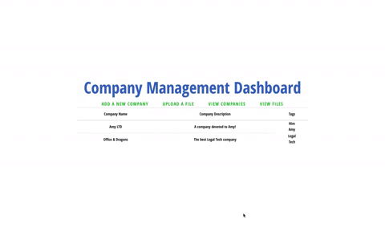
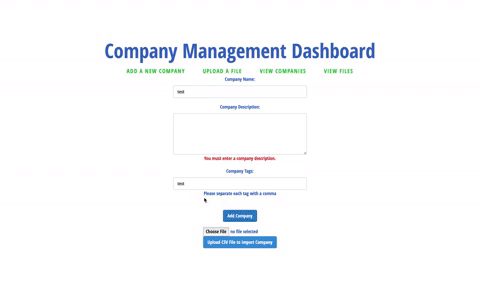
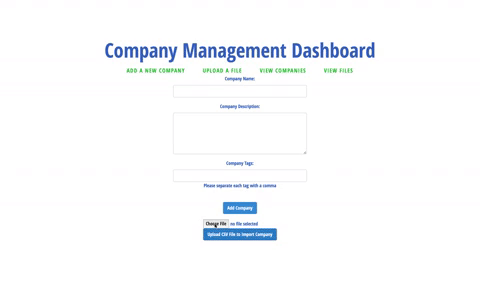

Company management dashboard built with PHP, Vue.js and Postgres. Capable of creating new companies, listing all companies, uploading files, listing all files, and importing company data from a csv file. 

## usage

## features

### scalability

tags

### user validation 

gifs
 
## built with 
[laravel](https://github.com/laravel) | [vue.js](https://github.com/vuejs) | [postgres](https://github.com/postgres)
