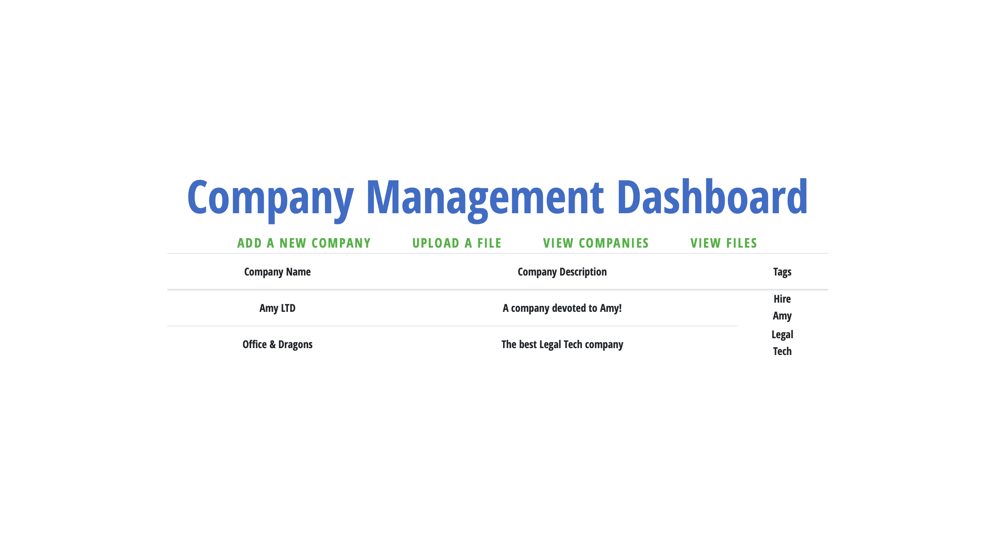

<p align="center">
</p>

Company management dashboard built with PHP, Vue.js and Postgres. Capable of creating new companies, listing all companies, uploading files, listing all files, and importing company data from a csv file. 

## usage

```
$ git clone https://github.com/amyconroy/company_dashboard.git company_dashboard
$ cd company_dashboard
```
Please ensure that you have installed [composer](https://getcomposer.org/download/) and [npm](https://www.npmjs.com/get-npm). 
```
$ composer install
$ npm install
$ cp .env.example .env
```
Now you will need to set up your database. In order to do so ensure that you have installed [postgres](https://www.postgresql.org/download/). You will need to a create a postgres database, this website uses the companydashboardDB name for the database but you can select whatever you would like, see [the postgres documentation](https://www.postgresql.org/docs/9.0/sql-createdatabase.html) if you need assistance. The database information in the .env file is currently: 
```
DB_CONNECTION=pgsql
DB_HOST=127.0.0.1
DB_PORT=5432
DB_DATABASE=companydashboardDB
DB_USERNAME=postgres
DB_PASSWORD=1234
```
You may need to update this depending on your local username and password, and whatever you named the database. Once you have added your credentials, you can create the database tables by:
```
$ php artisan migrate
```
Now you can start the website by running: 
```
$ npm run dev
```
If you have a macOS, it is recommended you use [valet](https://laravel.com/docs/7.x/valet) to run, however more information can be found in the laravel [docs](https://laravel.com/docs/4.2/installation#pretty-urls) if you are struggling to deploy the site. 

## features
<p align="center">
</p>
User can upload a file and see it listed on the files page. 

<p align="center">
</p>
User can upload a CSV file and use that information to fill in the companies details, including multiple companies at once. 

<p align="center">
</p>
User input is validated prior to inputing the data in the database. 

### scalability
There were a few key design choices made in order to ensure scalability: 
- The company and files tables include a userId input attribute in order to ensure that once a log in authentication is implemented the companies and files can be listed by user (simply changing the index function to get the files or companies that are stored with the userId instead, based on the session). 
- The many to many relationship between companies and tags is represented using a pivot table that stores the company id and tag id. This ensures that the database schema is normalised, and that in the future the user would be able to search for a company by tag. 
- The files are stored locally in the /storage folder, once the dashboard is deployed in production this would be easy to switch to using AWS to store the documents, see the [Laravel Docs](https://laravel.com/docs/7.x/filesystem#driver-prerequisites). 

## built with 
[laravel](https://github.com/laravel) | [vue.js](https://github.com/vuejs) | [postgres](https://github.com/postgres)
